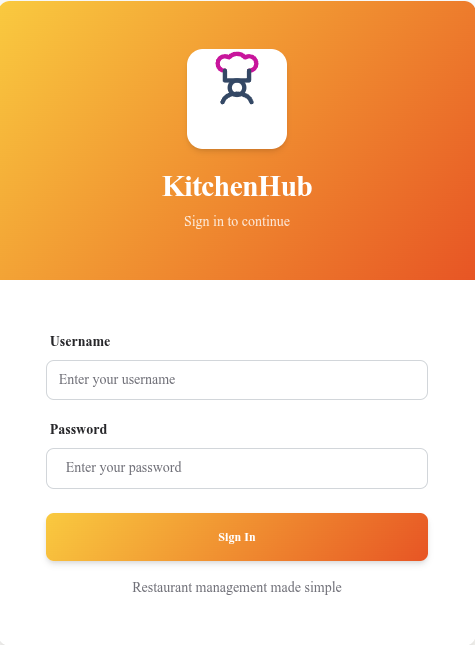
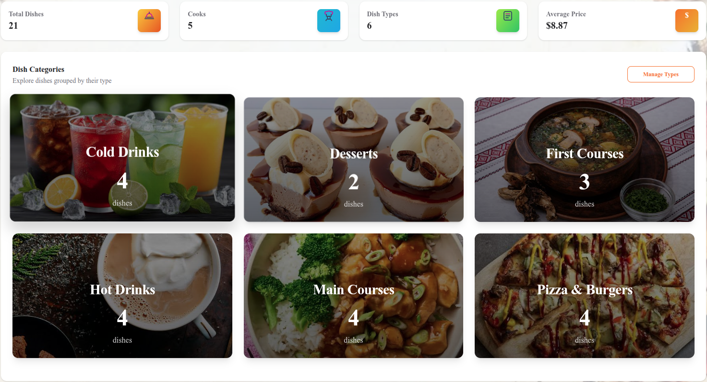
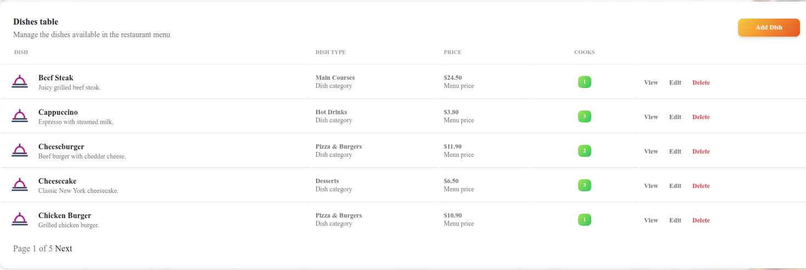
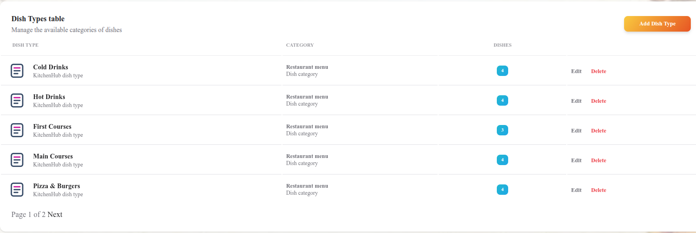
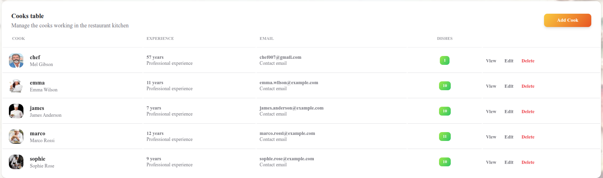
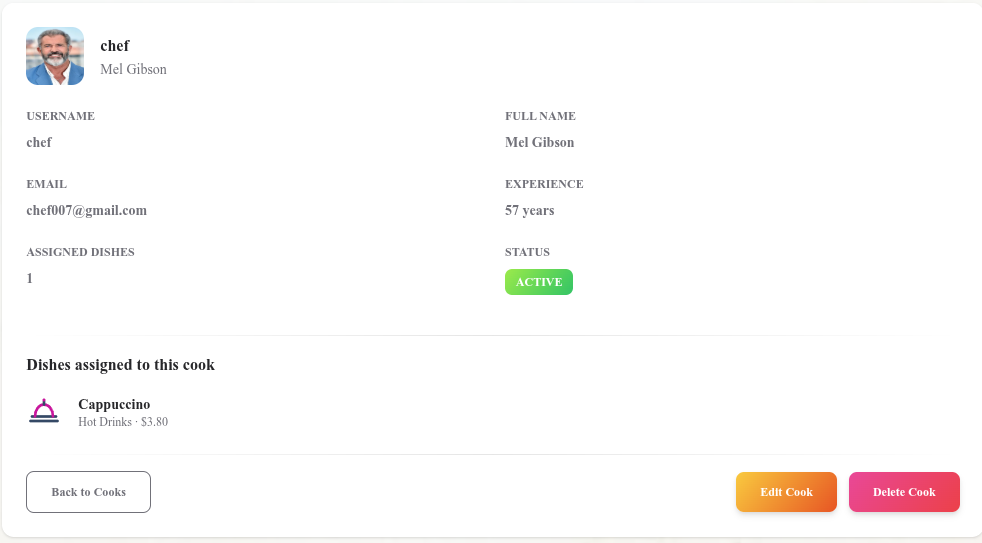

# KitchenHub

https://restaurant-project-django-v2f6.onrender.com/
credentials: chef / chef1991

Restaurant management system built with Django and Soft UI Dashboard.

KitchenHub allows administrators to manage dishes, dish categories and cooks through a modern and responsive web interface.

##  User credentials
The available KitchenHub user with all grants: chef / chef1991

## Installation

Python 3.12 or newer must be installed.

```shell
git clone https://github.com/supremacy91/restaurant-project-django.git 
cd KitchenHub
python3 -m venv .venv
source .venv/bin/activate
pip install -r requirements.txt
python manage.py migrate
python manage.py createsuperuser
python manage.py runserver
```

## Features

- Authentication
- Dashboard with statistics
- Dish management (CRUD)
- Dish type management (CRUD)
- Cook management (CRUD)
- Image upload
- Search
- Pagination
- Responsive design
- Django Admin panel


# Screenshots

## Login



## Dashboard



## Dishes



## Dish Types


## Cooks



## Cook Profile




#  Technologies

- Python 3.12
- Django 6.0.7
- SQLite
- Bootstrap 5
- Soft UI Dashboard
- Pillow


# License

This project was created for educational and portfolio purposes.


#  Author

Maksym Kaplunovskyi

GitHub:
https://github.com/supremacy91